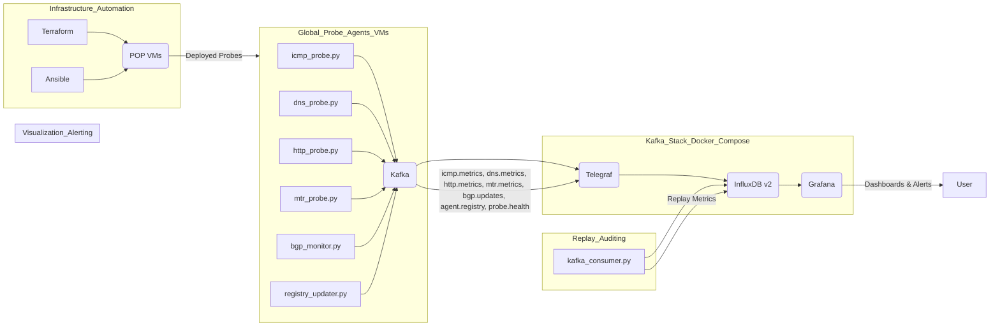

# Global Synthetic Network Monitoring Architecture Plan

## 🌐 Goal

Design a modular, resilient, and scalable architecture for **global synthetic network monitoring** using:

- Kafka (event bus)
- Telegraf (bridge/agent)
- InfluxDB v2 (time-series storage)
- Grafana (visualization)
- System-level Python agents (not containerized)

Probes run from distributed VMs (POPs), directly at the OS/systemd level to prevent downtime or missed probes.

---

## 🧱 Architecture Overview



### Project Structure

```
network-observability-tool-v3/
├── kafka/                     # Kafka stack configuration (docker-compose)
├── telegraf/                  # Telegraf configuration
├── influxdb/                  # InfluxDB configuration (if needed)
├── grafana/                   # Grafana configuration (dashboards)
│   └── grafana_dashboards/   # Grafana dashboard JSON files
├── probes/                    # Python probe agents
│   ├── icmp_probe.py
│   ├── dns_probe.py
│   ├── http_probe.py
│   ├── mtr_probe.py
│   ├── bgp_monitor.py
│   ├── registry_updater.py
│   ├── systemd/               # Systemd service units
│   └── cron/                  # Cron runner scripts (fallback)
├── tools/                     # Utility tools
│   └── replay/                # Kafka replay tool
│       └── kafka_consumer.py
├── terraform/                 # Terraform templates for POP VM deployment
└── ansible/                   # Ansible role for probe setup
└── docs/                      # Documentation
    └── README.md
```

### 1. Kafka Stack ( `network-observability-tool-v3/kafka/docker-compose.yml` )

We'll use Docker Compose to set up Kafka, Zookeeper, Telegraf, InfluxDB v2, and Grafana.

*   **docker-compose.yml**: This file will define all the services.
    *   **Kafka**: Configured with SASL\_SSL and username/password authentication. We'll define environment variables for usernames and passwords.
    *   **Zookeeper**:  Required by Kafka.
    *   **Telegraf**: Will act as a bridge, consuming from Kafka and writing to InfluxDB v2.
    *   **InfluxDB v2**: Time-series database to store metrics. We'll set up initial bucket and organization.
    *   **Grafana**: For visualization and alerting. We'll mount the dashboard JSONs from `grafana_dashboards/`.

### 2. Telegraf Configuration ( `network-observability-tool-v3/telegraf/telegraf.conf` )

Telegraf will be configured to:

*   **Input**: Consume messages from Kafka topics (`icmp.metrics`, `dns.metrics`, `http.metrics`, `mtr.metrics`, `bgp.updates`, `agent.registry`, `probe.health`).
*   **Output**: Write metrics to InfluxDB v2. We'll need to configure the InfluxDB v2 URL, token, organization, and bucket.

### 3. InfluxDB v2 Setup

We'll configure InfluxDB v2 through environment variables in `docker-compose.yml` or a separate configuration file if needed. We'll define:

*   Organization name
*   Bucket name for metrics
*   Admin user and token (for initial setup)

### 4. Grafana Dashboards ( `network-observability-tool-v3/grafana/grafana_dashboards/` )

We'll create JSON dashboard files for each metric type:

*   **ICMP Dashboard**: Visualize packet loss percentage and RTT over time.
*   **DNS Dashboard**: Visualize DNS resolution latency and status.
*   **HTTP Dashboard**: Visualize HTTP response time and error rates (non-200 status codes).
*   **MTR Dashboard**: Visualize per-hop latency and packet loss to identify network degradation points.
*   **BGP Dashboard**: Visualize BGP route updates, origin ASN changes (potential hijacks), and route flaps.
*   **Agent Registry Dashboard**: Visualize registered agents, their locations, and available metrics.
*   **Probe Health Dashboard**: Visualize probe heartbeats, uptime, and failure rates.

Each dashboard will include:

*   Relevant visualizations (time series graphs, gauges, etc.)
*   Variables for filtering by `probe_id`, `location`, and `target`.
*   Alert thresholds for key metrics (packet loss, HTTP errors, BGP origin ASN changes, missing heartbeats).

### 5. Probe Agents ( `network-observability-tool-v3/probes/` )

Python scripts for each probe type:

*   **`icmp_probe.py`**: Performs ICMP ping to targets and publishes `icmp.metrics`.
*   **`dns_probe.py`**: Performs DNS resolution and publishes `dns.metrics`.
*   **`http_probe.py`**: Performs HTTP GET requests and publishes `http.metrics`.
*   **`mtr_probe.py`**: Runs MTR traceroute and publishes `mtr.metrics`.
*   **`bgp_monitor.py`**: Monitors BGP routes using `pybgpstream` and publishes `bgp.updates`.
*   **`registry_updater.py`**: Publishes agent registry information to `agent.registry` on startup/boot.

Each probe script will:

*   Be configurable via command-line arguments (e.g., target, probe\_id, location, Kafka brokers).
*   Include a `--health-check` flag for local testing (prints output to stdout).
*   Publish metrics to Kafka in JSON format as defined in the requirements.
*   Include metadata tags (`probe_id`, `probe_type`, `geo_location`, `timestamp`).
*   Log events and errors to local syslog/journal for auditability.

We'll also create:

*   **Systemd service units** (in `probes/systemd/`) to manage each probe as a system service, ensuring automatic start on boot and restart on failures.
*   **Cron-compatible shell runners** (in `probes/cron/`) as a fallback deployment option if systemd is not preferred or available.

### 6. Agent Registry ( `network-observability-tool-v3/probes/registry_updater.py` )

The `registry_updater.py` script will:

*   Run on probe agent VMs (via systemd/cron).
*   On startup or system boot, it will publish a message to the `agent.registry` Kafka topic.
*   The message payload will include: `probe_id`, `ip`, `location`, `available_metrics` (list of probe types running on the agent), `version`, and `uptime`.

### 7. Internal Health Checks ( `probe.health` topic )

Each probe script will be enhanced to:

*   Periodically publish a "heartbeat" or health message to the `probe.health` Kafka topic.
*   The health message will include: `probe_id`, `last_successful_run` (timestamp), `uptime`, and `failures_last_hour` (count).
*   In Grafana, we'll set up alerts to trigger if no health message is received from a probe within a defined interval (e.g., N minutes).

### 8. Replayability & Auditing ( `network-observability-tool-v3/tools/replay/kafka_consumer.py` )

We'll create a Python CLI tool `kafka_consumer.py` (or a Jupyter notebook if preferred) to:

*   Consume messages from Kafka topics.
*   Filter messages by `probe_id`, `metric_type`, and date range.
*   Rewrite the filtered metrics back into InfluxDB v2. This will allow replaying historical data for analysis or backfilling.

### 9. Infrastructure Automation ( `network-observability-tool-v3/terraform/`, `network-observability-tool-v3/ansible/` )

*   **Terraform Template ( `terraform/` )**:
    *   Will define infrastructure as code to deploy new POP VMs on providers like Hetzner or Linode.
    *   Will include VM provisioning (OS, network, etc.).
*   **Ansible Role ( `ansible/` )**:
    *   Will automate the probe agent setup on newly deployed VMs.
    *   Tasks will include:
        *   Installing Python and required Python packages (`kafka-python`, `pybgpstream`, etc.).
        *   Configuring probe scripts (copying scripts, setting Kafka broker addresses, probe\_id, location, etc.).
        *   Setting up systemd services for probes and registry updater.
        *   Automatic registration of the probe to Kafka (using `registry_updater.py`).

### 10. Documentation ( `network-observability-tool-v3/docs/README.md` )

A comprehensive `README.md` will be created to document the entire setup. It will include:

*   **Architecture Diagram**:  The Mermaid diagram above will be included.
*   **Deployment Guide for Probes**: Step-by-step instructions on how to deploy probe agents to new VMs using Terraform and Ansible.
*   **Monitoring System Status**: Instructions on how to use Grafana dashboards to monitor network performance and probe health.
*   **Onboarding New Targets**: How to add new targets (URLs, IPs, DNS resolvers, BGP prefixes) to be monitored by the probes.
*   **CLI Reference**: Documentation for the `kafka_consumer.py` replay tool and any other CLI utilities.
*   **Beginner-friendly language**: The README will be written to be easily understandable for someone setting up the lab from scratch and learning the technologies involved.

<<<<<<<======== Next Section: Deployment Guide for Probes ========>>>>>>>

## Deployment Guide for Probes

This section guides you through deploying new probe agents to monitor your network.

### Prerequisites

Before deploying probes, ensure you have:

1.  **Hetzner Cloud Account (or similar provider)**: You'll need an account to create new VMs.
2.  **Terraform Installed**: Follow the [official Terraform installation guide](https://learn.hashicorp.com/terraform/install/cli).
3.  **Ansible Installed**: Follow the [official Ansible installation guide](https://docs.ansible.com/ansible/latest/installation_guide/index.html).
4.  **Hetzner Cloud API Token**: Generate an API token from your Hetzner Cloud console.
5.  **SSH Key**: Add your SSH public key to your Hetzner Cloud account. The Terraform template assumes you have an SSH key named `default-ssh-key` in your Hetzner Cloud account. You can change this in `terraform/variables.tf` if needed.

### Steps to Deploy a New POP VM and Probe Agent

1.  **Navigate to the `terraform` directory:**

    ```bash
    cd network-observability-tool-v3/terraform
    ```

2.  **Configure Terraform Variables:**

    *   Create a `terraform.tfvars` file in the `terraform/` directory.
    *   Add the following variables, replacing the values with your actual Hetzner Cloud API token and desired settings:

        ```terraform
        hcloud_token = "YOUR_HETZNER_CLOUD_API_TOKEN"
        server_name = "pop-nyc-01" # Example server name
        server_location = "nyc1"    # Example location: New York
        ```

    *   You can also customize `server_type`, `server_image`, and `ssh_key_name` variables in `terraform.tfvars` or directly in `terraform/main.tf`.

3.  **Initialize Terraform:**

    ```bash
    terraform init
    ```

4.  **Apply Terraform Configuration:**

    ```bash
    terraform apply
    ```

    *   Review the plan and type `yes` to confirm and create the VM.
    *   Terraform will output the public IP address of the newly created VM once the deployment is complete. Note down this IP address.

5.  **Navigate to the `ansible` directory:**

    ```bash
    cd ../ansible
    ```

6.  **Configure Ansible Inventory:**

    *   Create an `inventory.ini` file in the `ansible/` directory.
    *   Add the following, replacing `POP_VM_IP_ADDRESS` with the IP address obtained from Terraform output:

        ```ini
        [pop_vms]
        pop_vm_host ansible_host=POP_VM_IP_ADDRESS ansible_user=root
        ```
        *   Adjust `ansible_user` if you are not using the root user (ensure your user has sudo privileges).

7.  **Run Ansible Playbook:**

    ```bash
    ansible-playbook -i inventory.ini main.yml -k
    ```
    *   Ansible will connect to the new VM, install Python and dependencies, copy probe scripts, set up systemd services, and start the probes.
    *   Enter the SSH password for the `root` user when prompted (or configure SSH key-based authentication for Ansible).

8.  **Verify Probe Deployment:**

    *   SSH into the POP VM:

        ```bash
        ssh root@POP_VM_IP_ADDRESS
        ```

    *   Check if the probe services are running:

        ```bash
        systemctl status icmp_probe.service dns_probe.service http_probe.service mtr_probe.service bgp_monitor.service registry_updater.service
        ```

    *   Check probe logs:

        ```bash
        journalctl -u icmp_probe.service -u dns_probe.service -u http_probe.service -u mtr_probe.service -u bgp_monitor.service -u registry_updater.service
        ```

    *   Verify agent registration in Grafana Agent Registry Dashboard.

Congratulations! You have successfully deployed a new POP VM and probe agent.

<<<<<<<======== Next Section: Monitoring System Status ========>>>>>>>

## Monitoring System Status

Once probes are deployed and running, you can monitor the system status using Grafana dashboards.

1.  **Access Grafana:**

    *   Open your web browser and navigate to `http://localhost:3000` (or the Grafana port you configured in `docker-compose.yml`).
    *   Log in with the Grafana admin credentials (default: `admin`/`password123`).

2.  **Explore Dashboards:**

    *   In the Grafana sidebar, click on "Dashboards" -> "Browse".
    *   You should see the following dashboards:
        *   ICMP Dashboard
        *   DNS Dashboard
        *   HTTP Dashboard
        *   MTR Dashboard
        *   BGP Dashboard
        *   Agent Registry Dashboard
        *   Probe Health Dashboard

    *   Click on each dashboard to view the visualizations and metrics.

3.  **Dashboard Features:**

    *   **Time Range Selection**: Use the time range picker in the top right corner to adjust the time window for the dashboards.
    *   **Filters**: Most dashboards include variables (e.g., `probe_id`, `location`, `target`, `resolver`, `prefix`) that allow you to filter the data displayed. Use the dropdown menus at the top of the dashboard to select specific probes, targets, or other entities.
    *   **Alerts**: Dashboards are pre-configured with alert thresholds for key metrics. Grafana will trigger alerts when these thresholds are exceeded (e.g., packet loss > 10%, HTTP errors). Configure notification channels in Grafana to receive alerts (e.g., email, Slack).

4.  **Probe Health Dashboard:**

    *   Use the "Probe Health Dashboard" to monitor the health and status of your probe agents.
    *   This dashboard visualizes probe uptime and failure rates, helping you identify any issues with probe agents.
    *   Set up alerts on this dashboard to be notified if any probe agent stops reporting health metrics.

By regularly monitoring these dashboards, you can gain insights into your network performance and identify potential issues proactively.

<<<<<<<======== Next Section: Onboarding New Targets ========>>>>>>>

## Onboarding New Targets for Probing

To monitor new targets (websites, IPs, DNS resolvers, BGP prefixes), you need to configure the probe agents to include these targets in their monitoring.

The configuration is primarily done within the probe scripts themselves. You would need to:

1.  **Modify Probe Scripts:**
    *   Edit the Python probe scripts (e.g., `icmp_probe.py`, `http_probe.py`, `dns_probe.py`, `mtr_probe.py`, `bgp_monitor.py`) to include your new targets.
    *   Targets are typically defined as command-line arguments to the probe scripts (e.g., `--target`, `--url`, `--resolver`, `--prefix`).
    *   You can hardcode targets directly in the scripts for simple setups, or implement more dynamic target management (e.g., reading targets from a configuration file or external source).

2.  **Update Systemd Service Units (or Cron Jobs):**
    *   Modify the systemd service units (or cron jobs) to reflect the changes in target configurations in the `ExecStart` command.
    *   For systemd, you would typically edit the service files in `/etc/systemd/system/` (e.g., `icmp_probe.service`, `http_probe.service`, etc.) and reload systemd configuration:

        ```bash
        sudo systemctl daemon-reload
        sudo systemctl restart icmp_probe.service http_probe.service dns_probe.service mtr_probe.service bgp_monitor.service
        ```

    *   For cron, you would edit the crontab file (`crontab -e`) to update the cron job commands with new targets.

**Example: Adding a new HTTP target**

1.  **Edit `http_probe.service`:**

    ```bash
    sudo vi /etc/systemd/system/http_probe.service
    ```

2.  **Modify `ExecStart` line to include a new URL:**

    ```
    ExecStart=/usr/bin/env python3 /probes/http_probe.py --probe-id=http-probe-01 --location="New York" --url=http://new-target-website.com --kafka-brokers=kafka:9093
    ```

3.  **Reload systemd and restart the service:**

    ```bash
    sudo systemctl daemon-reload
    sudo systemctl restart http_probe.service
    ```

Repeat this process for other probe types and targets as needed.

For more advanced target management, consider implementing a configuration management system (e.g., Ansible, Chef, Puppet) or a dedicated target management service that dynamically updates probe configurations.

<<<<<<<======== Next Section: CLI Reference for Replay Tool ========>>>>>>>

## CLI Reference for Replay Tool ( `kafka_consumer.py` )

The `kafka_consumer.py` tool allows you to replay historical metrics data from Kafka back into InfluxDB v2 for analysis or backfilling.

**Usage:**

```bash
./kafka_consumer.py [options]
```

**Options:**

*   `--kafka-brokers`: Kafka brokers address (comma-separated). Default: `localhost:9092`.
*   `--topics`: Comma-separated list of Kafka topics to consume (required). Example: `--topics "icmp.metrics,http.metrics"`.
*   `--probe-id`: Filter metrics by `probe_id`. Example: `--probe-id "icmp-probe-01"`.
*   `--metric-type`: Filter metrics by metric type (e.g., `icmp`, `dns`, `http`, `mtr`, `bgp`, `agent`). Example: `--metric-type "icmp"`.
*   `--start-date`: Start date for replay (ISO 8601 format UTC). Example: `--start-date "2025-04-15T00:00:00Z"`.
*   `--end-date`: End date for replay (ISO 8601 format UTC). Example: `--end-date "2025-04-16T23:59:59Z"`.
*   `--influxdb-url`: InfluxDB URL. Default: `http://localhost:8086`.
*   `--influxdb-token`: InfluxDB token (required).
*   `--influxdb-org`: InfluxDB organization (required).
*   `--influxdb-bucket`: InfluxDB bucket. Default: `network_metrics`.

**Example Usage:**

1.  **Replay ICMP and HTTP metrics for probe `icmp-probe-01` for the last 24 hours:**

    ```bash
    ./kafka_consumer.py \
      --kafka-brokers "kafka:9093" \
      --topics "icmp.metrics,http.metrics" \
      --probe-id "icmp-probe-01" \
      --start-date "$(date -u -d '24 hours ago' +%Y-%m-%dT%H:%M:%SZ)" \
      --end-date "$(date -u +%Y-%m-%dT%H:%M:%SZ)" \
      --influxdb-token "YOUR_INFLUXDB_TOKEN" \
      --influxdb-org "monitoring_org"
    ```

2.  **Replay all DNS metrics for the last 7 days:**

    ```bash
    ./kafka_consumer.py \
      --kafka-brokers "kafka:9093" \
      --topics "dns.metrics" \
      --metric-type "dns" \
      --start-date "$(date -u -d '7 days ago' +%Y-%m-%dT%H:%M:%SZ)" \
      --end-date "$(date -u +%Y-%m-%dT%H:%M:%SZ)" \
      --influxdb-token "YOUR_INFLUXDB_TOKEN" \
      --influxdb-org "monitoring_org"
      --influxdb-bucket "historical_metrics" # Example: replay to a different bucket
    ```

**Note:**

*   Ensure you have the correct InfluxDB token and organization configured.
*   Adjust Kafka brokers and topic names as needed for your setup.
*   Date ranges are specified in ISO 8601 UTC format. Use `date -u` command to generate UTC timestamps in the correct format.
*   You can replay data to a different InfluxDB bucket by using the `--influxdb-bucket` option (e.g., for historical data analysis).

This replay tool provides a flexible way to re-ingest historical network monitoring data for various purposes, such as testing, analysis, and backfilling data in your InfluxDB v2 instance.

---
## Author

[shankar0123](https://github.com/shankar0123)

Feel free to contribute to this project or report any issues on GitHub.